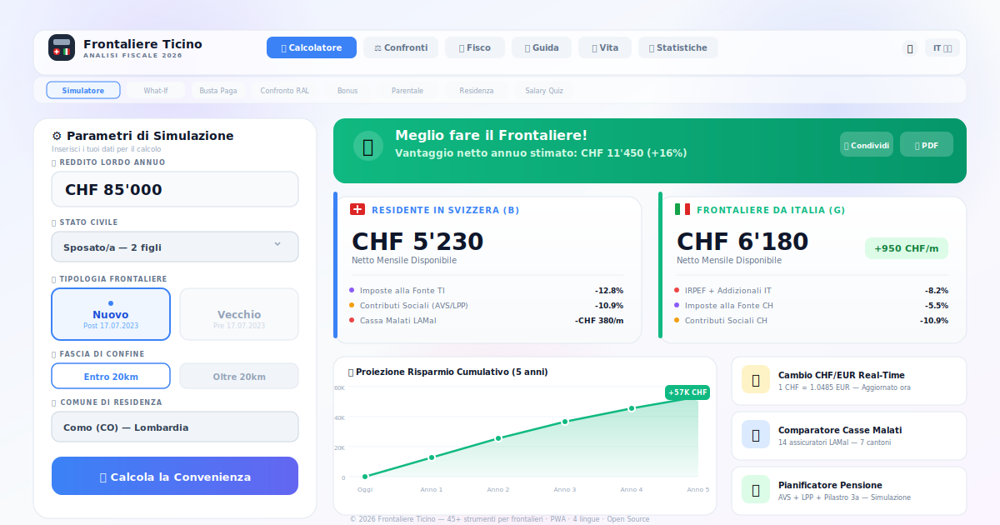

# Frontaliere Ticino

**Simulatore Fiscale Avanzato Svizzera-Italia**

Questa applicazione web single-page (SPA) aiuta i lavoratori a valutare la convenienza economica tra il vivere in Svizzera (Residente B) e il lavorare come Frontaliere (Permesso G), tenendo conto del **Nuovo Accordo Fiscale 2026** tra Svizzera e Italia.



## 🚀 Funzionalità Principali

*   **Calcolo Real-Time**: Simulazione istantanea del netto mensile basata su reddito lordo, stato civile e figli a carico.
*   **Doppio Regime Fiscale**:
    *   **Vecchio Frontaliere**: Tassazione esclusiva alla fonte in Svizzera (per chi ha lavorato in CH tra il 2018 e il 17.07.2023).
    *   **Nuovo Frontaliere**: Tassazione concorrente Svizzera + IRPEF Italia con franchigia di 10.000€ e credito d'imposta.
*   **Analisi Dettagliata**:
    *   Scomposizione delle deduzioni sociali svizzere (AVS, LPP, ecc.).
    *   Calcolo imposte alla fonte Canton Ticino.
    *   Calcolo IRPEF italiana (scaglioni 2026) e Addizionali.
*   **Personalizzazione Spese**: Possibilità di aggiungere spese ricorrenti (affitto, auto, spesa) per calcolare il vero "residuo netto" a fine mese.
*   **Export PDF Professionale**: Generazione di un report dettagliato scaricabile per uso personale.
*   **Dati Aggiornati**: Tassi di cambio in tempo reale e parametri fiscali configurabili.

## 🛠 Tech Stack

Il progetto è costruito con tecnologie web moderne per garantire performance e usabilità:

*   **React 19**: Core framework per l'interfaccia utente.
*   **TypeScript**: Per la sicurezza dei tipi e la robustezza del codice.
*   **Tailwind CSS**: Per lo styling responsivo e il supporto Dark Mode nativo.
*   **Recharts**: Per la visualizzazione grafica dei dati comparativi.
*   **jsPDF & autoTable**: Per la generazione dei report PDF client-side.
*   **Lucide React**: Per icone vettoriali leggere e moderne.

## 📦 Installazione e Avvio

1.  Clona il repository:
    ```bash
    git clone https://github.com/valerielinc-ops/frontaliere-si-o-no.git
    ```
2.  Installa le dipendenze:
    ```bash
    npm install
    ```
3.  (Opzionale) Configura TomTom Routing API per dati traffico reali:
    ```bash
    cp .env.example .env
    # Esporta TOMTOM_API_KEY nell'ambiente quando lanci il collector traffico
    ```
4.  Avvia il server di sviluppo:
    ```bash
    npm run dev
    ```

## 🗺️ API Esterne (Opzionali)

### TomTom Routing API
Per ottenere dati di traffico reali ai valichi di confine CH-IT:

1. Crea un account su [TomTom Developer Portal](https://developer.tomtom.com/)
2. Genera una API key
3. Esporta la chiave per il collector schedulato o locale: `TOMTOM_API_KEY=your_key`

**Costi**: il collector usa richieste route singole con traffico live. In locale e in CI è supportato ancora `GOOGLE_MAPS_API_KEY` come fallback legacy durante la migrazione.

Senza snapshot live disponibili, l'app usa dati di traffico simulati basati su orari di punta tipici.

## 📝 Note Fiscali

Questo strumento fornisce stime basate sulle aliquote e le leggi vigenti (o previste) per il 2026. Sebbene accurato, non sostituisce il parere di un commercialista o fiduciario professionista.

*   **Canton Ticino**: Le aliquote alla fonte sono stimate interpolando le tabelle A, B, C e H.
*   **Italia**: Il calcolo IRPEF include le detrazioni per lavoro dipendente e familiari a carico standard.

## 🤝 Contribuire

Il progetto è aperto a contributi. Se trovi un bug nel calcolo o vuoi aggiungere una funzionalità, sentiti libero di aprire una Issue o una Pull Request.

## 📄 Licenza

Distribuito sotto licenza MIT. Vedi `LICENSE` per maggiori informazioni.
