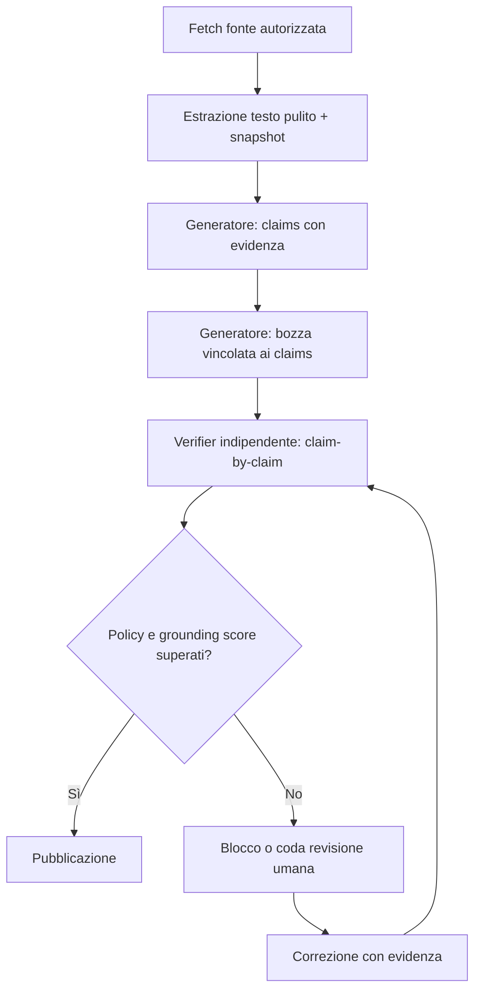

## Problema
Gli articoli generati a partire da fonti corrette possono introdurre dati, dettagli, citazioni, nessi causali o contenuti **non presenti e non supportati dalla fonte originaria**. È un bug strutturale di affidabilità editoriale: la generazione non mantiene un vincolo sufficiente di fedeltà alla fonte (grounding).

## Esempio riproducibile

### Fonte originaria
- https://www.laregione.ch/economia/economia/1941028/primo-semestre-perdita-obiettivi-trimestre

La fonte riporta, tra l'altro: perdita netta di 0,5 milioni nel primo semestre, ricavi +4% a 190 milioni di euro, EBITDA rettificato -2% a 28 milioni, ricavi del secondo trimestre -2% a 91 milioni, revisione al ribasso degli obiettivi e piano di riduzione di circa un quarto dei circa 1.600 posti entro fine 2026. [page:191]

### Articolo generato
- https://frontaliereticino.ch/articoli-svizzera/lastminute-com-perdita-obiettivi-trimestre/

Il fetch automatico della pagina generata non è stato completato in fase di segnalazione; il confronto puntuale deve quindi essere riprodotto dall'applicazione o con uno snapshot del contenuto pubblicato. Tuttavia, il comportamento segnalato è chiaro: a partire da una fonte affidabile, l'articolo finale riporta contenuti inventati/non verificati.

## Impatto
- Diffusione di informazioni potenzialmente false su temi economici e societari.
- Rischio reputazionale e legale/editoriale per Frontaliereticino.ch.
- Perdita di fiducia degli utenti e possibile peggioramento dei segnali di qualità SEO/E-E-A-T.
- Rischio di propagare errori nelle newsletter, social, Google Discover/News e sistemi di recommendation.

## Obiettivo
1. Identificare la causa strutturale delle allucinazioni nella pipeline di generazione.
2. Correggere l'articolo di esempio e tutte le occorrenze simili già pubblicate.
3. Introdurre un workflow automatico di **claim verification** che blocchi o metta in revisione gli articoli con affermazioni non supportate dalla/e fonte/i.
4. Mantenere un audit trail completo: fonte, estrazione, claim, evidenza, decisione e correzione.

## Analisi richiesta

### A. Ricostruire la pipeline
- [ ] Identificare fonte/raw content usato in input, data di fetch e versione del prompt/modello.
- [ ] Verificare se il sistema riassume una fonte estratta, usa web research aggiuntiva o combina fonti non dichiarate.
- [ ] Verificare se il modello riceve contenuto incompleto, troncato, rumoroso o contaminato da elementi della pagina (related articles, ads, navigation).
- [ ] Verificare eventuale uso di memoria/cache/RAG e la sua isolamento per singolo articolo.
- [ ] Identificare in quale step vengono introdotte le affermazioni non supportate: estrazione, outline, drafting, rewrite, traduzione o post-processing SEO.

### B. Confronto claim-by-claim
- [ ] Estrarre tutti i claim fattuali dall'articolo generato.
- [ ] Per ogni claim, associare uno o più passaggi esatti della fonte che lo supportano.
- [ ] Classificare: `supported`, `partially_supported`, `unsupported`, `contradicted`, `needs_secondary_source`.
- [ ] Quantificare support ratio e severity degli errori.
- [ ] Salvare snapshot immutabili di fonte e articolo per debugging/regressione.

## Correzione strutturale proposta

### 1. Generazione vincolata alla fonte
Il modello deve ricevere istruzioni non negoziabili:
- Scrivere esclusivamente fatti supportati dalle fonti autorizzate.
- Non inferire, non stimare, non completare informazioni mancanti.
- Se un dato non è presente, ometterlo oppure esplicitare l'incertezza.
- Distinguere nettamente tra fatto, interpretazione attribuita e contesto editoriale.
- Non creare citazioni, nomi, date, importi, ruoli, dichiarazioni o riferimenti.

Output intermedio obbligatorio:
```json
{
  "claims": [
    {
      "id": "c1",
      "claim": "Lastminute.com ha chiuso il primo semestre con una perdita netta di 0,5 milioni di euro.",
      "source_url": "https://www.laregione.ch/economia/economia/1941028/primo-semestre-perdita-obiettivi-trimestre",
      "evidence_quote": "Il periodo si è chiuso con una perdita netta di 0,5 milioni...",
      "source_locator": "paragraph:2"
    }
  ]
}
```

Solo dopo una validazione positiva dei claim, il testo può essere trasformato in articolo pubblicabile.

### 2. Verificatore automatico indipendente
Aggiungere un secondo step/modelo (critic/verifier) separato dal generatore:
1. Estrarre claim atomici dalla bozza.
2. Cercare evidenza nelle fonti autorizzate, usando quote e locator.
3. Assegnare stato e confidenza a ogni claim.
4. Calcolare un `grounding_score`.
5. Decidere automaticamente: pubblica, richiedi revisione o blocca.

Regole minime:
- Claim `contradicted` => blocco automatico.
- Claim numerico, temporale, nominativo o giuridico `unsupported` => blocco automatico.
- `grounding_score < 0.98` per contenuti economici/news => review umana obbligatoria.
- Ogni articolo deve includere almeno una fonte esplicita e la relativa provenienza interna.

### 3. Separare facts e copy SEO
- La fase SEO può ottimizzare struttura, title, meta description e leggibilità.
- Non può introdurre nuovi fatti, statistiche, confronti, previsioni o interpretazioni.
- Applicare un diff semantico tra testo verificato e output post-SEO: ogni nuovo claim deve essere verificato prima della pubblicazione.

### 4. Human-in-the-loop basato sul rischio
Mettere sempre in revisione manuale gli articoli che trattano:
- economia, aziende quotate, finanza e dati societari;
- lavoro, fiscalità, diritto, salute o sicurezza;
- notizie urgenti;
- fonti incomplete, non fetchabili o con extraction score basso.

## Workflow automatico futuro

### Pre-pubblicazione


### Post-pubblicazione giornaliero
- [ ] Scansionare gli articoli generati/pubblicati nell'ultima finestra configurabile.
- [ ] Recuperare snapshot della fonte o della fonte autorizzata.
- [ ] Riestrarre claim e rieseguire verifica di supporto.
- [ ] Segnalare in dashboard/issue gli articoli con claim `unsupported` o `contradicted`.
- [ ] Per errori ad alta gravità: deindicizzare temporaneamente o impostare `noindex`, notificare il team e creare una correzione proposta.
- [ ] Per errori correggibili: generare patch con solo claim supportati, richiedere approvazione umana e registrare changelog.
- [ ] Salvare feedback e categorie di errore nel dataset di regressione per migliorare prompt, regole e verifier.

## Remediation contenuti esistenti
- [ ] Correggere immediatamente l'articolo Lastminute.com dopo confronto claim-by-claim.
- [ ] Identificare tutti gli articoli generati dallo stesso workflow/versione modello.
- [ ] Eseguire backfill di verifica su backlog storico, prioritizzando contenuti YMYL, economici e news.
- [ ] Aggiungere data di aggiornamento e changelog interno quando un articolo viene corretto.

## Implementazione tecnica indicativa
- `src/content-generation/sourceSnapshot.*` — acquisizione, pulizia, hash e storage immutabile delle fonti.
- `src/content-generation/claimExtractor.*` — estrazione claim atomici.
- `src/content-generation/claimVerifier.*` — evidence retrieval e classificazione supporto.
- `src/content-generation/publishPolicy.*` — soglie e decisione pubblica/review/blocco.
- `scripts/audit-generated-articles.*` — audit schedulato e backfill storico.
- `.github/workflows/content-grounding-audit.yml` — workflow pianificato, se il processo risiede nel repository.
- `data/content-quality-regression/` — dataset di esempi fonte→claim→verdetto, incluso questo caso.

## Metriche
- Grounding score medio e per categoria.
- Percentuale articoli bloccati/revisionati prima della pubblicazione.
- Numero claim unsupported/contradicted per 100 articoli.
- Tempo medio dalla rilevazione alla correzione.
- Tasso di recidiva per categoria di errore.
- Numero di fonti non fetchabili o con estrazione incompleta.

## Criteri di accettazione
- [ ] È documentata la root cause dell'esempio Lastminute.com.
- [ ] L'articolo di esempio è corretto o ritirato, con confronto claim-by-claim archiviato.
- [ ] Nessun claim fattuale viene pubblicato senza evidenza tracciabile in una fonte autorizzata.
- [ ] Verifier indipendente attivo prima della pubblicazione per articoli generati.
- [ ] Numeri, date, nomi, citazioni e affermazioni ad alto rischio non supportati bloccano la pubblicazione.
- [ ] Workflow giornaliero rileva e segnala potenziali allucinazioni negli articoli esistenti.
- [ ] Gli articoli problematici seguono un percorso review/correzione/depubblicazione definito.
- [ ] Dataset di regressione e test automatici impediscono il ritorno dello stesso difetto.

## Note
- I rilevatori di testo AI o plagio non risolvono il problema principale: qui occorre verificare la fedeltà fattuale rispetto alla fonte, claim per claim. Strumenti dedicati alla rilevazione di affermazioni fabbricate possono supportare il controllo, ma non sostituiscono evidenza e policy interne. [web:181][web:178]
- La fonte originaria indica che il proprio articolo è stato pubblicato con ausilio dell'IA; questo rafforza la necessità di preservare il testo verificabile della fonte e di non amplificarne/aggiungervi ulteriori inferenze. [page:191]

## Riferimenti
- [Fonte: laRegione — Lastminute.com: primo semestre in perdita, rivisti gli obiettivi](https://www.laregione.ch/economia/economia/1941028/primo-semestre-perdita-obiettivi-trimestre) [page:191]
- [Articolo generato da verificare](https://frontaliereticino.ch/articoli-svizzera/lastminute-com-perdita-obiettivi-trimestre/)

